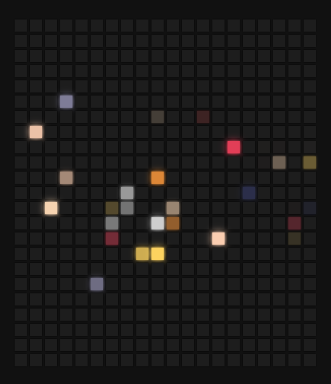
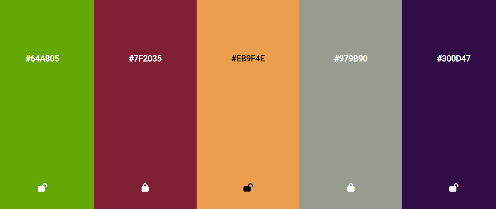
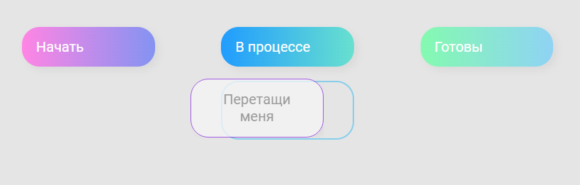

1. Слайдер фотографий и цветов  
https://codepen.io/AlinaK96/pen/bGmeENm  

 

2. Генерация цветов по наведению мыши  
https://codepen.io/AlinaK96/pen/gOBMPpz  

 

3. Игра, в которой генерируются шарики рандомного размера и цвета  
https://codepen.io/AlinaK96/pen/KKGVbad  
 

4. Слайдер фотографий  
https://codepen.io/AlinaK96/pen/ExdyPVK  

 

5. Рандомайзер цветов  
При нажатии на enter/space у вас будет возможность генерировать рандомный цвет для всех колонок. Понравившийся цвет можно заблокировать и подбирать остальные цвета. Можно также скопировать ссылку на страницу и другой пользователь получит вашу цветовую палитру.  
https://codepen.io/AlinaK96/pen/RweKEEp  

 

6. Item drag and drop  
https://codepen.io/AlinaK96/pen/OJBXyqv  

 